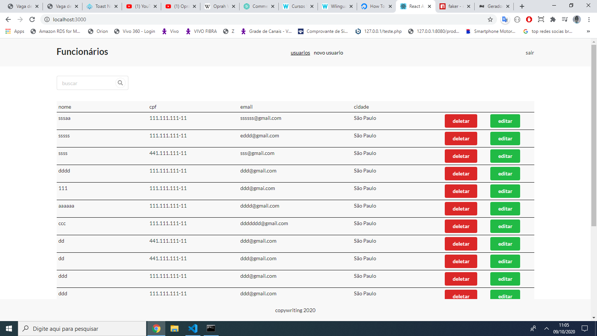
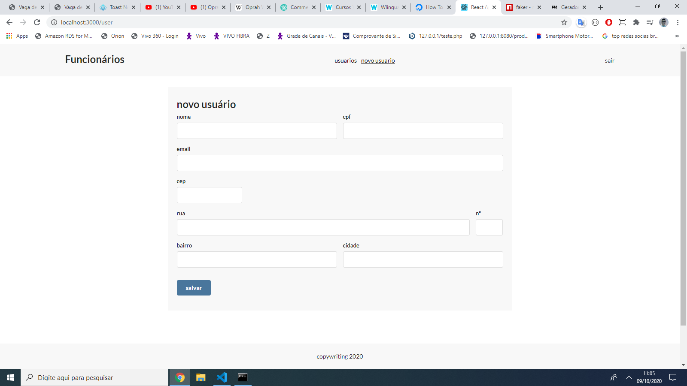
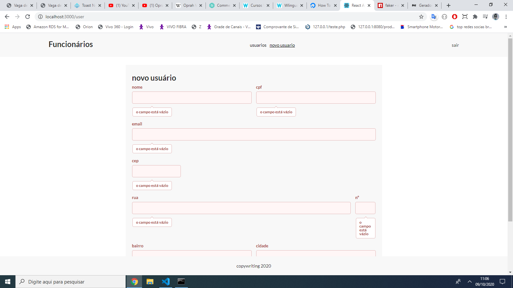
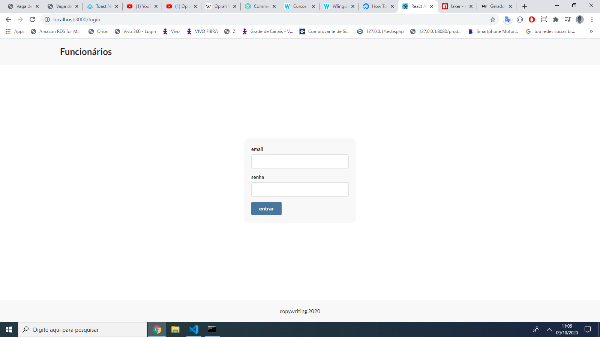
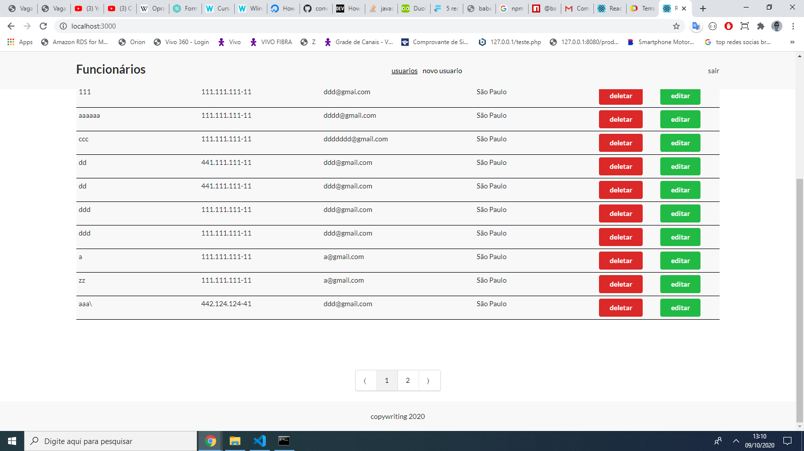

Projeto desenvolvido com react

### `para rodar o projeto`

clone o repositório

npm install para instalar as dependencias;

na raiz do projeto execute

json-server --watch db.json --delay 2000 --port 5000

 
para simular uma servidor backend

  
rode  

 
npm start 

 
para iniciar a aplicação localmente 

no login 

use qualquer email e uma senha com no minimo 4 caracteres para logar;

Open [http://localhost:3000](http://localhost:3000) to view it in the browser.

Lista os usuários

Formulário para cadastrar/editar usúario

Formulário para cadastrar/editar usúario com erros

Login

Lista os usuários com Paginação

